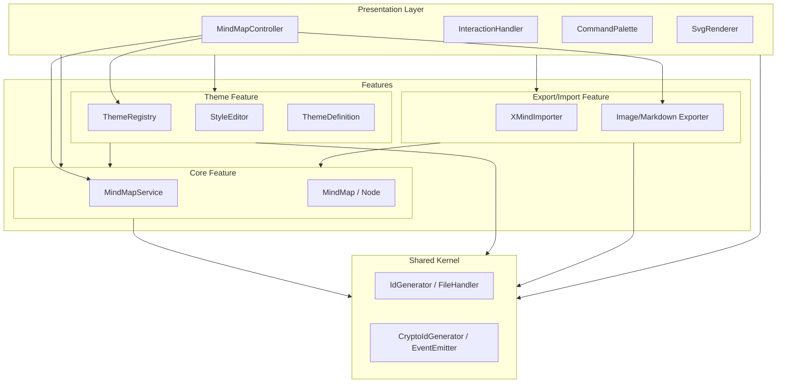
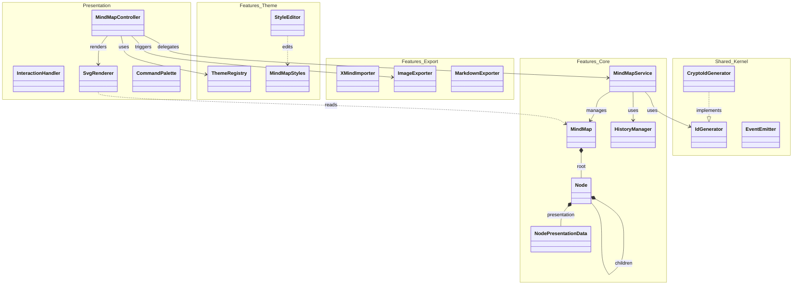
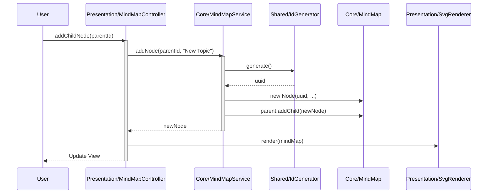
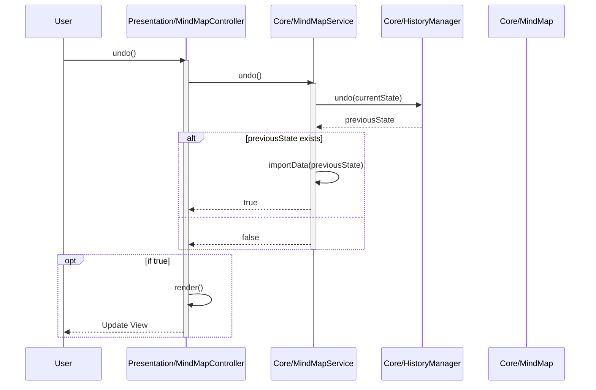
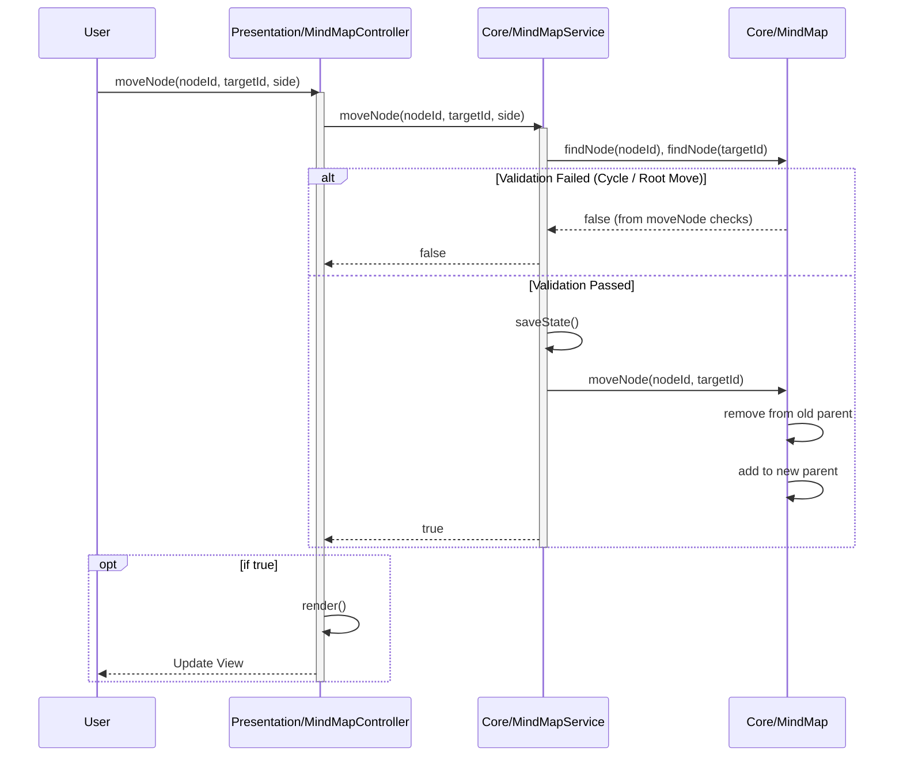
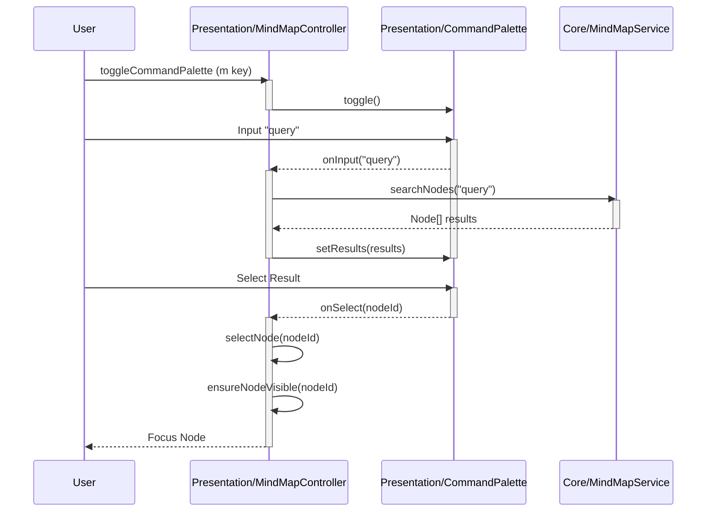
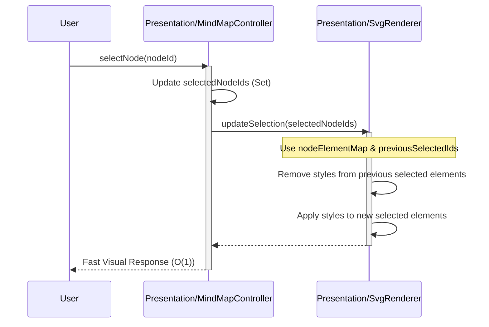

# Kakidash Software Architecture Design

## 1. Architecture Overview

Kakidash is designed based on **Clean Architecture** principles to enhance maintainability, testability, and extensibility.
Following the dependency rule, outer layers (Presentation, Infrastructure) depend on inner layers (Domain, Application).

### 1.1 Dependency Graph (Layers)



### 1.2 Module/Class Dependency Diagram

This diagram shows concrete relations between major classes.



## 2. Directory Structure

The source code is organized into directories based on layer responsibilities.

```
src/
├── features/         # Vertical slices by feature (Package by Feature)
│   ├── core/         # Core domain capability
│   │   ├── domain/       # MindMap, Node, Core Interfaces
│   │   └── application/  # MindMapService, HistoryManager
│   ├── theme/        # Theme & Styling capability
│   │   ├── domain/       # Theme Definition
│   │   ├── components/   # StyleEditor
│   │   ├── registry/     # ThemeRegistry
│   │   └── resources/    # Presets
│   └── export_import/ # Export/Import capability
│       ├── ImageExporter
│       ├── MarkdownExporter
│       └── XMindImporter
├── shared/           # Shared Kernel
│   ├── kernel/       # Pure utilities (IdGenerator, FileHandler)
│   └── infrastructure/ # Shared infrastructure (CryptoIdGenerator, EventEmitter)
├── presentation/     # Application-wide UI integration
│   ├── components/   # Shared UI components (Renderer, CommandPalette)
│   └── logic/        # Global orchestration (MindMapController, InteractionHandler)
├── infrastructure/   # Layered infrastructure implementations (if needed)
└── index.ts          # Entry point (Dependency Injection)
```

## 3. Layer Details

### 3.1 Features (`src/features`)

Modules sliced vertically by feature.

#### Core Feature (`src/features/core`)
Contains the core domain and application logic of the Mind Map.
- **Domain**: `MindMap`, `Node` Entities, `MindMapData` and `NodePresentationData` Interfaces (Strict separation of Domain and View state).
- **Application**: `MindMapService` (Use Cases including bulk operations), `HistoryManager` (History Management).

#### Theme Feature (`src/features/theme`)
Functionality related to styling and theme management.
- **Domain**: `ThemeDefinition API`, `MindMapStyles`, `StyleAction`.
- **Components**: `StyleEditor`.
- **Registry**: `ThemeRegistry` (Theme application management).

#### Export/Import Feature (`src/features/export_import`)
Input/Output functionality with external formats.
- `XMindImporter`: Import XMind files.
- `ImageExporter`: SVG/PNG export.
- `MarkdownExporter`: Markdown export.

### 3.2 Shared Kernel (`src/shared`)

Common components referenced by all features.
- **Kernel**: `IdGenerator` (Interface), `FileHandler` (Interface).
- **Infrastructure**: `CryptoIdGenerator` (Impl), `TypedEventEmitter` (Impl).

### 3.3 Presentation Layer (`src/presentation`)

Integrates features and provides the user interface.
- **MindMapController**: Main controller orchestrating features (Core, Theme, Export). Manages selection state (single/multi).
- **InteractionHandler**: Handing user input operations.
- **Components**:
  - **SvgRenderer**: Responsible for rendering the mind map using SVG and HTML. Implements **Differential Rendering** for high performance:
    - **DOM Caching**: Uses `nodeElementMap` to cache node DOM elements for O(1) access.
    - **Delta Updates**: Separates full re-renders from selection updates. Selection changes only modify the styles/attributes of affected elements without rebuilding the DOM.
  - **CommandPalette**: Command user interface.

## 4. Major Processing Sequence

### 4.1 Node Addition Flow

This diagram illustrates the interaction between layers when a user adds a node.



### 4.2 Undo/Redo Flow

This diagram illustrates the history management and state restoration flow using the Memento pattern.



### 4.3 Node Move Flow (Drag & Drop)

This diagram shows the validation and execution flow when moving a node.



### 4.4 Search and Command Palette Flow

Flow when a user performs a search.



### 4.5 Selection Update Flow (Optimized Path)

This diagram shows the fast-path selection update that avoids a full re-render.



## 5. Entry Point and DI (`src/index.ts`)

Instantiates components and injects dependencies upon application startup.

```typescript
// DI Example
const idGenerator = new CryptoIdGenerator(); // Shared/Infrastructure
const mindMap = new MindMap(rootNode);       // Core/Domain
const service = new MindMapService(mindMap, idGenerator); // Core/Application <- Core/Domain, Shared/Infrastructure
const controller = new MindMapController(mindMap, service, renderer, ...); // Presentation <- Core/Application
```

## 6. Key Design Principles

- **Dependency Inversion Principle (DIP)**:
  - High-level modules (Service) do not depend on low-level modules (Infrastructure) but on abstractions (Interfaces) (e.g., `IdGenerator`).
- **Single Responsibility Principle (SRP)**:
  - Each class has a single responsibility (e.g., `MindMapService` for logic, `SvgRenderer` for rendering).
- **DRY (Don't Repeat Yourself)**:
  - Extraction of common logic (e.g., ID generation, style definitions).
- **Type Safety**:
  - Ensuring compile-time safety by eliminating `any` types and using strict type definitions.
