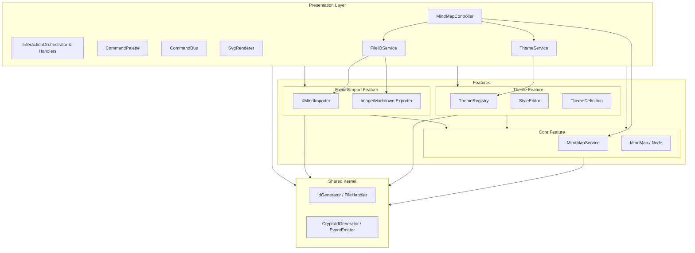
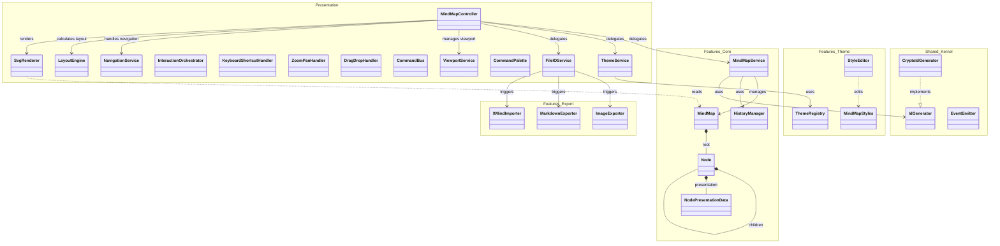
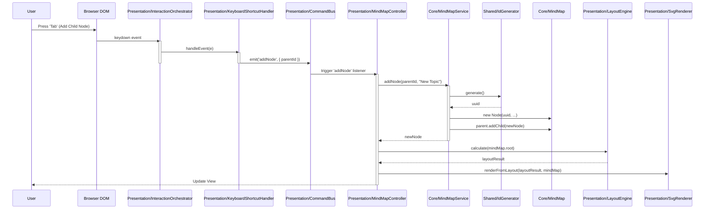
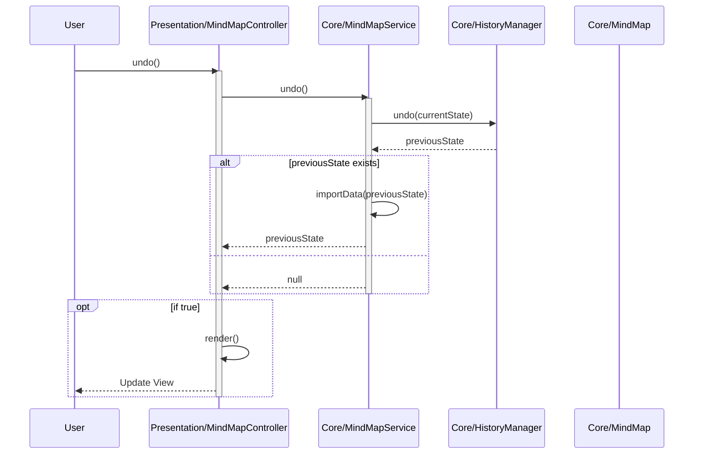
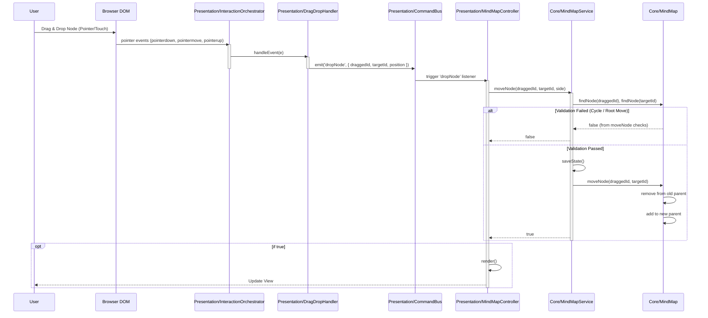
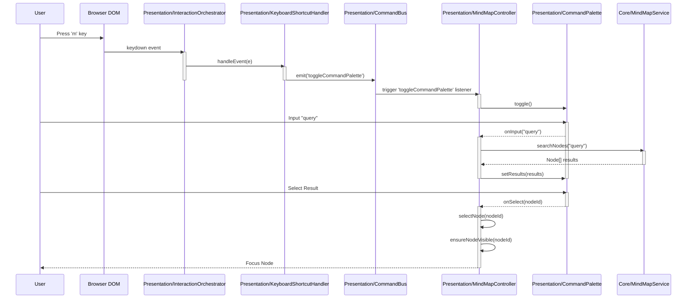
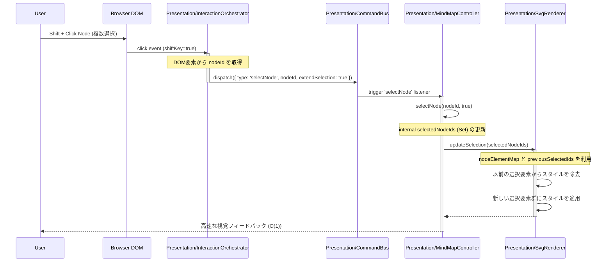
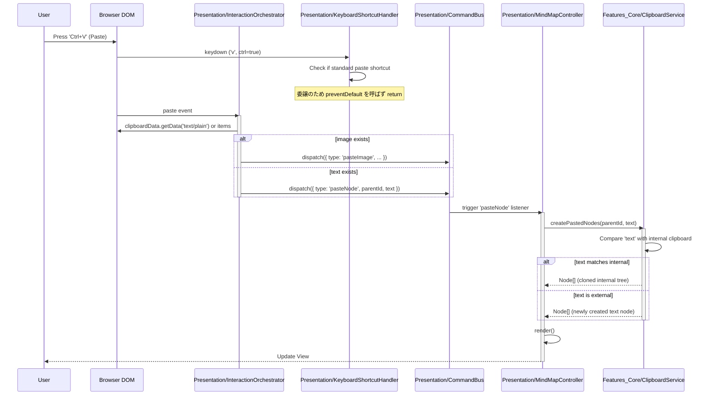

# Kakidash ソフトウェアアーキテクチャ設計書

## 1. アーキテクチャ概要

Kakidashは、メンテナンス性、テスト容易性、拡張性を高めるために **Clean Architecture（クリーンアーキテクチャ）** の原則に基づいて設計されています。
依存関係のルールに従い、外側のレイヤー（Presentation, Infrastructure）が内側のレイヤー（Domain, Application）に依存する形をとっています。

### 1.1 依存関係図 (レイヤー)



### 1.2 モジュール/クラス依存関係図

主要なクラス間の具体的な関係を示す図です。



## 2. ディレクトリ構造

ソースコードは各レイヤーごとの責務に基づいてディレクトリ分割されています。

```
src/
├── features/         # 機能ごとの並置 (Package by Feature)
│   ├── core/         # コアドメイン機能
│   │   ├── domain/       # MindMap, Node, Core Interfaces
│   │   └── application/  # MindMapService, HistoryManager
│   ├── theme/        # テーマ・スタイリング機能
│   │   ├── domain/       # Theme Definition
│   │   ├── components/   # StyleEditor
│   │   ├── registry/     # ThemeRegistry
│   │   └── resources/    # Presets
│   └── export_import/ # エクスポート・インポート機能
│       ├── ImageExporter
│       ├── MarkdownExporter
│       └── XMindImporter
├── shared/           # 共有カーネル
│   ├── kernel/       # 純粋なユーティリティ (IdGenerator, FileHandler)
│   └── infrastructure/ # インフラ共通 (CryptoIdGenerator, EventEmitter)
├── presentation/     # アプリケーション全体のUI統合
│   ├── components/   # 共通UIコンポーネント (Renderer, CommandPalette)
│   ├── layout/       # 配置計算エンジン (LayoutEngine)
│   ├── commands/     # CommandBusの制御と定義 (CommandBus, Command)
│   └── logic/        # 全体制御 (MindMapController, InteractionOrchestrator)
│       └── handlers/ # 分割された入力イベントハンドラー群
├── infrastructure/   # レイヤー化されたインフラ実装 (必要に応じて)
└── index.ts          # エントリーポイント (Dependency Injection)
```

## 3. レイヤー詳細

### 3.1 Features (`src/features`)

機能ごとに垂直方向にスライスされたモジュール群です。

#### Core Feature (`src/features/core`)
マインドマップの核心となるドメインとアプリケーションロジックを含みます。
- **Domain**: `MindMap`, `Node` エンティティ, `MindMapData` 及び `NodePresentationData` インターフェース（ドメイン状態とビジュアルバージョン状態の厳格な分離）。
- **Application**: `MindMapService` (ユースケース、一括操作処理含む), `HistoryManager` (履歴管理)。

#### Theme Feature (`src/features/theme`)
スタイリングとテーマ管理に関する機能です。
- **Domain**: `ThemeDefinition API`, `MindMapStyles`, `StyleAction`。
- **Components**: `StyleEditor`。
- **Registry**: `ThemeRegistry` (テーマの適用管理)。

#### Export/Import Feature (`src/features/export_import`)
外部フォーマットとの入出力機能です。
- `XMindImporter`: XMindファイルのインポート。
- `ImageExporter`: SVG/PNGエクスポート。
- `MarkdownExporter`: Markdownエクスポート。

### 3.2 Shared Kernel (`src/shared`)

全機能から参照可能な共通コンポーネントです。
- **Kernel**: `IdGenerator` (Interface), `FileHandler` (Interface)。
- **Infrastructure**: `CryptoIdGenerator` (Impl), `TypedEventEmitter` (Impl)。

### 3.3 Presentation Layer (`src/presentation`)

各機能を統合し、ユーザーインターフェースを提供します。
- **MindMapController**: 各機能（Core, Theme, Export）をオーケストレーションするメインコントローラー。選択状態（単一・複数）を管理し、ビューポート・ナビゲーション・IO・テーマの操作は専用の各サービスに完全に委譲します。
- **ViewportService**: ズームやパン操作、アニメーションループなどのビューポート制御を担当します。
- **NavigationService**: 方向に応じたノード間のナビゲーションロジックを担当します。
- **ThemeService**: テーマやスタイルの変更・適用ロジックを管理し、ThemeRegistry経由でコンテナに適用します。
- **FileIOService**: マインドマップデータのインポート（XMind）およびエクスポート（PNG, SVG, Markdown）の操作を統合・実行します。
- **CommandBus**: 各種入力やアクションによって生成されたコマンド（Action）を中央集権的に受けとり、リスナーにルーティングして実行させるメッセージング基盤。これによりコンポーネント間の疎結合を実現しています。
- **InteractionOrchestrator & Handlers**: ユーザー操作の入力を処理し、コマンドバスへと流す役割。
  - `InteractionOrchestrator`: DOMのイベントリスナー管理やフォーカス制御など、入力処理のライフサイクル全体を管理します。
  - 各種ハンドラー (`KeyboardShortcutHandler`, `ZoomPanHandler`, `DragDropHandler`): DOMイベントを解釈し、論理的な振る舞い（ズームやノード移動など）の `Command` オブジェクトを生成して `CommandBus` に送信します。
- **LayoutEngine**: マインドマップのツリー構造から各ノードの配置座標（X, Y）と接続線のパスを計算し、`LayoutResult` を生成します。
- **Components**:
  - **SvgRenderer**: SVGとHTMLを使用してマインドマップを描画します。`LayoutEngine` が計算したレイアウトデータをもとに描画を行います。高パフォーマンス維持のため **差分レンダリング（Differential Rendering）** を実装しています。
    - **DOMキャッシュ**: `nodeElementMap` を使用して各ノードのDOM要素をキャッシュし、O(1) でのアクセスを可能にします。
    - **差分更新**: フルレンダリングと選択状態の更新を分離。選択変更時にはDOMを再構築せず、対象要素のスタイル/属性のみを変更します。
  - **CommandPalette**: コマンドUI。

## 4. 主要な処理シーケンス

### 4.1 ノード追加フロー

ユーザーがノードを追加する際の、各レイヤー間の相互作用を示します。



### 4.2 Undo/Redo フロー

Mementoパターンを使用した履歴管理と状態復元の流れを示します。



### 4.3 ノード移動フロー (Drag & Drop)

ノード移動時の検証と実行フローを示します。



### 4.4 検索とコマンドパレットフロー

ユーザーが検索を行う際のフローです。



### 4.5 選択更新フロー（最適化パス）

フルレンダリングを回避する、選択更新の高速パスを示します。



### 4.6 クリップボード処理（貼り付け）フロー

ブラウザのネイティブ `paste` イベントを利用した、画像およびテキスト（内部・外部）の貼り付けフローです。



## 5. エントリーポイントとDI (`src/index.ts`)

アプリケーションの起動時に各コンポーネントのインスタンス化と依存性の注入（Dependency Injection）を行います。

```typescript
// DIの例
const idGenerator = new CryptoIdGenerator(); // Shared/Infrastructure
const mindMap = new MindMap(rootNode);       // Core/Domain
const service = new MindMapService(mindMap, idGenerator); // Core/Application <- Core/Domain, Shared/Infrastructure
const controller = new MindMapController(mindMap, service, renderer, ...); // Presentation <- Core/Application
```

## 6. 主要な設計原則

- **依存性逆転の原則 (DIP)**:
  - 上位モジュール（Service）は下位モジュール（Infrastructure）に依存せず、抽象（Interface）に依存しています（例: `IdGenerator`）。
- **単一責任の原則 (SRP)**:
  - 各クラスは単一の責務を持ちます（例: `MindMapService`はロジック、`SvgRenderer`は描画）。
- **DRY (Don't Repeat Yourself)**:
  - 共通ロジックの抽出（例: ID生成、スタイル定義）。
- **型安全性**:
  - `any`型の排除と厳密な型定義によるコンパイル時の安全性確保。
