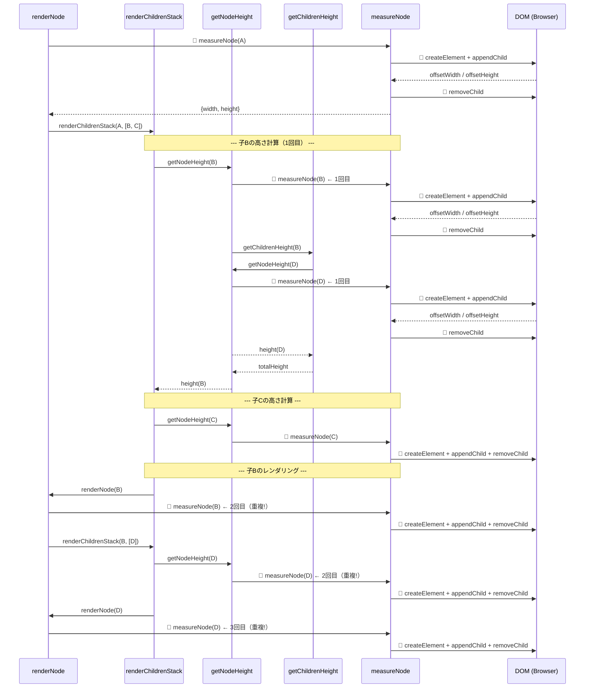
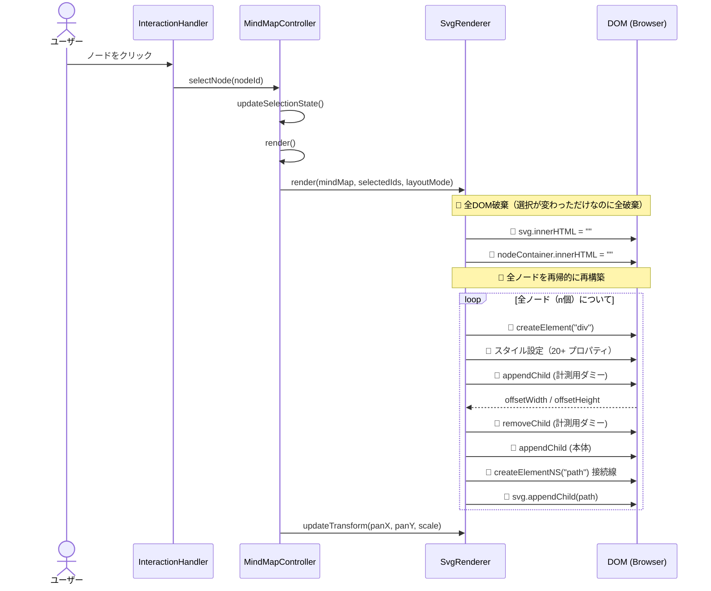
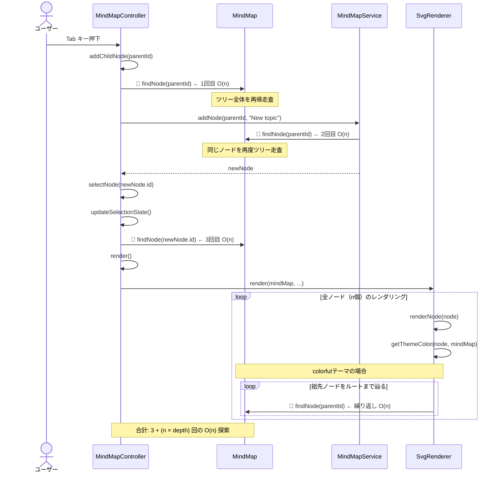

# マインドマップ パフォーマンス分析レポート

## 問題概要

ノード数が増加するとマインドマップの操作（選択、追加、編集、undo/redo等）が著しく遅くなる。

---

## 原因分析

コードベースを精査し、以下の **3つの根本原因** を特定しました。

### 原因1: measureNode のDOMベース計測 × 指数関数的重複呼び出し（**最大のボトルネック**）

[measureNode](file:///workspaces/kakidash/src/presentation/components/SvgRenderer.ts#L585-L698) は各ノードの幅・高さを計算するために、**毎回DOMにダミー要素を追加→`offsetWidth`/`offsetHeight`を取得→削除** という高コストな操作を行います。

さらに、[getNodeHeight](file:///workspaces/kakidash/src/presentation/components/SvgRenderer.ts#L568-L583) → [getChildrenHeight](file:///workspaces/kakidash/src/presentation/components/SvgRenderer.ts#L564-L566) の再帰構造により、同じノードの`measureNode`が **指数関数的に重複呼び出し** されます。

**影響度: ★★★★★（致命的）** — DOM reflow/relayoutは最もコストが高い操作。

#### シーケンス図: measureNode の重複呼び出し

> ノードA（子: B, C）、ノードB（子: D）の3階層ツリーの例。🔴がボトルネック箇所。

> [!CAUTION]
> たった4ノードでも `measureNode(D)` が **3回**、`measureNode(B)` が **2回** 呼ばれます。ノード数nが増えると呼び出し回数は **O(n²)〜O(n³)** に増大し、それぞれがDOM reflow を引き起こします。

---

### 原因2: 全DOM破棄＋再構築による完全再レンダリング

[render()](file:///workspaces/kakidash/src/presentation/components/SvgRenderer.ts#L54-L88)は毎回呼ばれるたびに全DOM要素を破棄し再構築します。`this.render()`は[コントローラ内で22箇所](file:///workspaces/kakidash/src/presentation/logic/MindMapController.ts)から呼ばれ、選択変更・ノード追加・テーマ変更・undo/redo等あらゆる操作でフルレンダリングが発生します。

**影響度: ★★★★☆（重大）** — ノード数に比例してDOM生成コストが増大。

#### シーケンス図: ノード選択時の完全再レンダリング

> ユーザーがノードをクリックしたときの処理フロー。🔴がボトルネック箇所。

> [!CAUTION]
> 選択ノードが変わっただけでも **全ノードのDOM要素を破棄→再生成** します。100ノードなら100個のdiv生成 + 100回のmeasureNode(DOM操作) + 99本のSVGパス生成が毎回発生します。

---

### 原因3: findNode のO(n)再帰ツリー探索

[MindMap.findNode](file:///workspaces/kakidash/src/features/core/domain/MindMap.ts#L12-L27) はIDベースのノード検索を再帰的なツリー走査で行います（O(n)）。これが[MindMapService内で40箇所以上](file:///workspaces/kakidash/src/features/core/application/MindMapService.ts)から呼ばれ、1つの操作で複数回のO(n)探索が発生します。

また、[getThemeColor](file:///workspaces/kakidash/src/presentation/components/SvgRenderer.ts#L96-L124) では各ノードのレンダリング時にルート直下の祖先まで `findNode` を繰り返し呼ぶため、colorfulテーマ使用時はO(n × depth)のコストになります。

**影響度: ★★★☆☆（中程度）** — 単体では致命的でないが、原因1,2と組み合わさると悪化。

#### シーケンス図: ノード追加時のfindNode連鎖

> ユーザーがTabキーで子ノードを追加するときの処理フロー。🔴がボトルネック箇所。

> [!CAUTION]
> 1回のノード追加操作で `findNode` が最低3回呼ばれます。さらにcolorfulテーマでのレンダリング時には **全ノード × ツリー深度** 回の `findNode`（各O(n)）が追加されます。100ノード・深度5のツリーでは合計 **503回のO(n)走査** = 約50,000回のノード比較が発生します。

---

## 対策案と比較評価

### 対策A: measureNode キャッシュの導入（計測結果メモ化）

#### 概要
`render()`呼び出し時にキャッシュ用`Map<string, {width, height}>`を作成し、`measureNode`の結果をキャッシュ。同じレンダリングサイクル内で同一ノードの再計測を防止。

#### 変更箇所
- `SvgRenderer.ts` のみ（約30行の変更）

#### メリット
- **実装が最も簡単**（低リスク）
- 最大ボトルネックを直接解消
- 既存テストへの影響が最小限
- アーキテクチャの変更不要

#### デメリット
- 完全再レンダリング（原因2）は解消されない
- findNode問題（原因3）は解消されない

#### 期待効果
- `measureNode`のDOM操作がO(n²)→O(n)に改善
- **ノード100個で約5〜10倍の高速化が見込める**

| 項目 | 評価 |
|---|---|
| 実装コスト | ★☆☆☆☆（非常に低い） |
| リスク | ★☆☆☆☆（非常に低い） |
| 効果 | ★★★★☆（高い） |
| 保守性 | ★★★★★（優秀） |

---

### 対策B: 差分レンダリング（仮想DOM的アプローチ）

#### 概要
全DOM破棄＋再構築をやめ、変更が必要なノードのみを更新する。ノードIDをキーにしたDOM要素の`Map<string, HTMLElement>`を保持し、変更検知で差分更新。

#### 変更箇所
- `SvgRenderer.ts` の大規模リファクタリング（200〜300行の変更）
- `Renderer.ts` インターフェースの拡張の可能性
- E2Eテストの調整

#### メリット
- 原因1と原因2を同時に解消
- 選択変更のような軽微な操作が非常に高速に
- 将来的にアニメーション等も実装しやすくなる

#### デメリット
- **実装コストが高い**（大規模リファクタリング）
- バグ混入リスクが高い
- 位置計算ロジックの再設計が必要
- テストの大幅な調整が必要

#### 期待効果
- 選択変更等の軽微な操作: O(1)
- ノード追加等: O(変更ノード数)
- **ノード100個以上で10〜50倍の高速化の可能性**

| 項目 | 評価 |
|---|---|
| 実装コスト | ★★★★★（非常に高い） |
| リスク | ★★★★☆（高い） |
| 効果 | ★★★★★（最高） |
| 保守性 | ★★★☆☆（中程度） |

---

### 対策C: ノードID索引（HashMap）の導入 + measureNode キャッシュ

#### 概要
対策Aの`measureNode`キャッシュに加え、`MindMap`クラスにID→Node の`Map<string, Node>`を導入して`findNode`をO(1)化。ノードの追加・削除時にMapを同期更新する。

#### 変更箇所
- `MindMap.ts`: ノードマップの追加（約30行）
- `Node.ts`: `addChild`/`removeChild`でマップ更新のコールバック追加
- `SvgRenderer.ts`: measureNodeキャッシュ（対策Aと同様）
- 計 約60〜80行の変更

#### メリット
- 原因1と原因3を同時に解消
- 実装コストが中程度
- `findNode`が多用されるサービス層全体が高速化
- getThemeColorの祖先走査も高速化

#### デメリット
- ノード追加・削除時のMap同期にバグのリスク
- 完全再レンダリング（原因2）は解消されない
- Domainレイヤーへの変更がアーキテクチャ的に慎重を要する

#### 期待効果
- `findNode`: O(n) → O(1)
- `measureNode`: O(n²) → O(n)
- **ノード100個で約10〜20倍の高速化が見込める**

| 項目 | 評価 |
|---|---|
| 実装コスト | ★★☆☆☆（低い） |
| リスク | ★★☆☆☆（低い） |
| 効果 | ★★★★★（最高） |
| 保守性 | ★★★★☆（良い） |

---

## 総合比較

| 項目 | 対策A (キャッシュ) | 対策B (差分レンダリング) | 対策C (索引+キャッシュ) |
|---|---|---|---|
| 解消する原因 | 原因1のみ | 原因1, 2 | 原因1, 3 |
| 実装コスト | 最小 | 最大 | 小〜中 |
| リスク | 最低 | 最高 | 低 |
| 効果 | 高 | 最高 | 最高 |
| 推奨度 | ⭐⭐⭐ | ⭐⭐ | ⭐⭐⭐⭐⭐ |

## 推奨

> [!IMPORTANT]
> **対策C（ノードID索引 + measureNodeキャッシュ）を推奨します。**
>
> 理由：対策費用対効果（コスト対パフォーマンス改善比）が最も高く、2つの主要ボトルネックを同時に解消します。変更範囲も限定的で、リグレッションリスクが低いです。
>
> 対策Bは将来的に必要になる可能性がありますが、現時点では対策Cで十分な改善が得られると考えます。段階的に対策C → 対策B の順で適用するアプローチも有効です。
